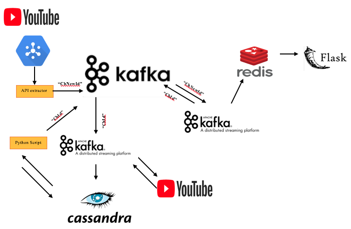

# Youtube Watcher
I did a consulting project during my insight data engineering fellowship. The goal was to improve the ingestion part of the data pipeline and I proposed and implemented a model for real time ingestion which improved data ingestion efficiency in terms of bandwidth usage, cost and time. Also, I've proposed a solution in order to merge the new data with old data in real time for real time analysis. 

1. [Overview](README.md#overview)
2. [Data](README.md#data)
3. [Pipeline](README.md#technologies)

## Overview

In this project, I've implemented real time data ingestion using Youtube Data API (v3), kafka  and redis to listen to youtube and get notificaiton when there is a change in any channel in real time. Then the channel Id and short statistics of the channel is stored in Redis. The goal is to set up youtube API to push notifications when any new video is posted to any channel. This method is more efficient than polling approach that fetch all data related to all channels once awhile.

## Data

There are two different stages for data ingestion. First is streaming changes thru kafka and second is getting whole data related to that channel from youtube. So all these data are streaming thru kafka back and forth.

## Technologies
Google PubSub, Youtube Data API (v3),Kafka, Flask, Redis, Python, AWS S3, Cassandra.

### Pipeline:

 
	
